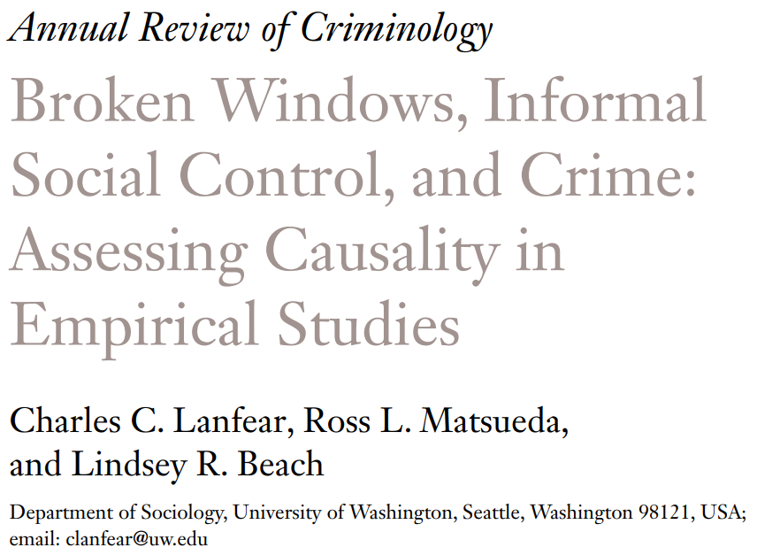
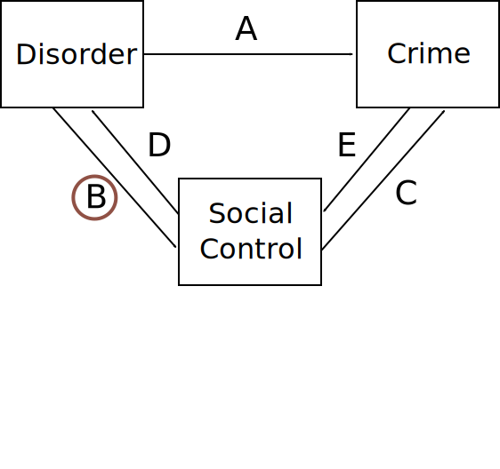
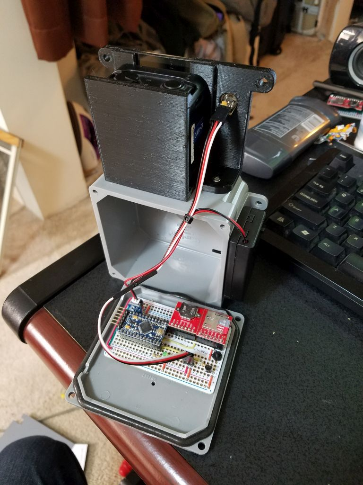

```{r setup, include=FALSE}
knitr::opts_chunk$set(echo=FALSE, 
                      warning = FALSE, 
                      message = FALSE, 
                      dev = "svg", 
                      fig.height = 5, 
                      dev.args=list(bg="transparent"))
library(tidyverse)
library(ggtext)
library(showtext)
library(sf)
library(ragg)

load("./data/WA_tract_2010.RData")
load("./data/lost_letter_tract_122117.RData")
load("./data/seattle_tracts.RData")
load("./data/seattle_all_data.RData")
load("./data/seattle_union.RData")
load("./data/letter_sf.RData")

`%!in%` <- Negate(`%in%`) 
showtext_auto()
exp_colors <- c("#342c5c", "#458490", "#905145", "grey", "#cbd3a3")
y_min <- st_bbox(seattle_union)[2]*0.99
y_max <- st_bbox(seattle_union)[4]*1.01
font_add_google("Quattrocento")
```


class: inverse, cct

# Broken Windows

---

# Broken Windows

At the macro-level [Wilson & Kelling (1982)](https://www.theatlantic.com/magazine/archive/1982/03/broken-windows/304465/) describe communities as a non-recursive system where...

.pull-left-60[


]

.pull-right-40[
* A: Disorder signals low guardianship which increases offending

* B, E: Disorder and crime signal danger and constrain social relations and impede control

* C, D: Social control inhibits disorder and crime
]

.centernote[
*A macro-micro model with explicit rational decision-making mechanisms*
]

---

## Keizer, Lindenberg, & Steg (2008)

Keizer et al. used multiple disorder manipulations and recorded norm violation with field experiments in Groningen, the Netherlands to test micro-level direct effects implied by broken windows.


.pull-left[


]

.pull-right[

* Disorder greatly increased all norm violation (A)

* **Strong internal validity** from experimental design

* **Weak external validity**: Single sites in one city with isolated minor norm violations

* Criticism: [Wicherts & Bakker (2014)](https://doi.org/10.1177/1368430213502); [Lanfear (2017)](http://hdl.handle.net/1773/40974)

]

.centernote[
*Highly cited evidence for causal effect of disorder on crime*
]

---

# Collective Efficacy

[Sampson & Raudenbush (1999)](https://doi.org/10.1086/210356) describe communities as a recursive system where disorder and crime are the result of low collective efficacy, i.e., social control capacity.

.pull-left-60[

]

.pull-right-40[
* A: Disorder has no direct impact on crime

* C, D: Disorder and crime are products of low collective efficacy

* B, E: Social control is exogenous
]

.centernote[
*A macro model with implicit decision-making micro mechanisms*
]

---

## Sampson & Raudenbush (1999)

Simultaneous equations of crime, disorder, and collective efficacy in Chicago neighborhoods, using survey-measured collective efficacy and objectives measure of disorder: Video of block faces coded by researchers.


.pull-left[


.small[<sup>*</sup> Effect found only for robbery.]

]


.pull-right[
* No disorder effect on crime (A) conditional on collective efficacy

* Control for crime impact on collective efficacy (E), but assume no disorder feedback (B)

* **Strong external validity**: *Real* disorder, crime, neighborhoods

* **Weak internal validity**: Cross-sectional, covariate adjustment, ambiguous mechanisms
]

.centernote[
*Influential observational macro-level evidence*
]


---

# Key Questions


* **How do we reconcile these results?**

* **How can we balance external and internal validity?**

<br>

Some preliminary thoughts:

.image-50[

]

---
class: inverse, sncp

# The Seattle Neighborhoods and Crime Project


---

## The Experiments

Over 2000 person-hours of **field experiments**, conducted over four years, embedded in representative Seattle neighbourhoods with rich **ecological survey data** (2002-2003 SNCS), e.g., collective efficacy 

* Balance experimental and observational strengths and weaknesses

* Maximize internal and external validity


--

&zwj;1. **Mailbox Experiment** (today)

* Effect of disorder on crime and prosocial behavior (replicate Keizer)
* Association between collective efficacy and crime and prosocial behavior

&zwj;2. **Littering Intervention**: (today)

* Effect of disorder on sanctioning behavior
* Association between collective efficacy and sanctioning behavior

--

&zwj;3. **Lost Letter**: Collective efficacy &#8594; prosocial behaviour

&zwj;4. **Litter Clean-Up**: Collective efficacy &#8594; disorder removal


---

<br>
<br>


---

# Number of Trials

```{r, eval=FALSE,  echo=FALSE, message=FALSE, cache=TRUE, warning=FALSE, dev='svg', fig.height = 5}
exp_df <- expand.grid(year = 2014:2017,
                      experiment = c("Lost Letter", "Mailbox", "Litter\nIntervention", "Litter\nClean-Up")) %>%
  mutate(active = case_when(
    experiment=="Mailbox" & year==2014 ~ 1,
    experiment=="Mailbox" & year==2015 ~ 1,    
    experiment=="Mailbox" & year==2016 ~ 1,
    experiment=="Mailbox" & year==2017 ~ 1,
    experiment=="Lost Letter" & year==2015 ~ 2,
    experiment=="Lost Letter" & year==2016 ~ 1,
    experiment=="Litter\nIntervention" & year==2017 ~ 1,
    experiment=="Litter\nClean-Up" & year==2016 ~ 2,
    experiment=="Litter\nClean-Up" & year==2017 ~ 1,
    TRUE ~ 0
  ), trials = case_when(
    experiment=="Mailbox" & year==2014 ~ 132,
    experiment=="Mailbox" & year==2015 ~ 41,    
    experiment=="Mailbox" & year==2016 ~ 104,
    experiment=="Mailbox" & year==2017 ~ 128,
    experiment=="Lost Letter" & year==2015 ~ 432,
    experiment=="Lost Letter" & year==2016 ~ 2938,
    experiment=="Litter\nIntervention" & year==2017 ~ 576,
    experiment=="Litter\nClean-Up" & year==2016 ~ 6,
    experiment=="Litter\nClean-Up" & year==2017 ~ 21,
    TRUE ~ as.numeric(NA)
)) %>%
  mutate(experiment = forcats::fct_relevel(experiment, "Litter\nClean-Up", "Litter\nIntervention", "Mailbox", "Lost Letter"))

exp_colors <- c("#342c5c",  "#905145", "#458490", "#cbd3a3")

experiment_timeline <- ggplot(exp_df, aes(x=factor(year), y=experiment, fill=factor(active))) + 
  xlab(NULL) + ylab(NULL) + ggtitle(NULL) + 
  geom_tile(color="white", width =1 , height = 1) + 
  geom_text(size=8, color="#cbd3a3", hjust=0.5, aes(label=trials), family = "Quattrocento") +
  scale_fill_manual("Trial Type", values=c("2" = "#458490", "1" = "#342c5c", "0" = "white"),
                    labels = c("2" = "Pilot", "1" = "Standard", "0" = "")) +
  coord_fixed(ratio = 1, expand=FALSE) +
  scale_y_discrete(labels = ) +
  theme(
        text = element_text(family = "Quattrocento", size = 20, debug = FALSE),
        legend.position = "right",
        axis.text.y = element_text(hjust = 0.5, color = exp_colors, face = "bold"),
        panel.grid = element_blank(),
        axis.ticks = element_blank(),
        panel.background = element_blank(),
        plot.margin = margin(0, 0, 0, 0)
    )
experiment_timeline
# ggsave(file = "./img/experiment_timeline.svg")
```

.image-full-width[

]

---

```{r, eval=FALSE, echo=FALSE, warning=FALSE, message=FALSE, cache=TRUE, results='hide', dev="svg", fig.height=6.15}
letter_tracts <- c("00100", "01000", "10100", "10200", "10300", "10500", "10600", 
                   "10800", "10900", "01100", "11101", "11102", "11200", "11300", 
                   "11500", "11600", "11700", "11800", "11900", "01200", "12000", 
                   "12100", "01300", "01400", "01500", "01600", "01800", "01900", 
                   "00200", "02000", "02100", "02200", "02400", "02500", "02600", 
                   "02700", "02800", "02900", "00300", "03000", "03100", "03200", 
                   "03300", "03400", "03500", "03600", "03800", "03900", "04000", 
                   "00401", "00402", "04100", "04200", "04400", "04500", "04600", 
                   "04700", "04800", "04900", "00500", "05000", "05100", "05200", 
                   "05301", "05400", "05600", "05700", "05801", "05802", "05900", 
                   "00600", "06000", "06100", "06200", "06300", "06400", "06500", 
                   "06600", "06700", "06800", "06900", "00700", "07000", "07100", 
                   "07200", "07300", "07500", "07600", "07700", "07800", "07900", 
                   "00800", "08001", "08002", "08100", "08200", "08300", "08400", 
                   "08500", "08600", "08700", "08800", "08900", "00900", "09000", 
                   "09100", "09200", "09400", "09500", "09600", "09701", "09702", 
                   "09800", "09900", "10001", "10401", "10701", "11001", "11401", 
                   "01701", "04301", "07401", "10002", "10402", "10702", "11002", 
                   "11402", "01702", "04302", "07402")

mailbox_tracts <- c("02700", "08900", "09200", "06800", "07500", "09100", "02800", 
                   "00100", "10002", "10300", "10402", "10600", "02600", "05600", 
                   "06100", "06300", "07402", "07800", "09000", "09701")
  
littering_tracts <- c("00100", "01701", "02600", "04700", "06800", "07100", "07500", 
                      "08900", "09100", "09701", "10402", "11402")
KC_tract_2010 <- maptools::elide(WA_tract_2010[WA_tract_2010@data$COUNTYFP10=="033",], rotate=-16)
map_tracts <- st_as_sf(KC_tract_2010[as.numeric(str_sub(KC_tract_2010@data$GISJOIN, -5,-1)) %in% 100:12100, "GISJOIN"]) %>%
  mutate(tract = str_sub(GISJOIN, -5,-1))
experiment_tracts <-  map_tracts %>%
  mutate(mailbox = tract %in% mailbox_tracts,
         littering = tract %in% littering_tracts,
         lost_letter = tract %in% letter_tracts) %>%
  mutate(Experiment = case_when(
    mailbox==TRUE & littering==TRUE ~ "Mailbox, Litter Intervention",
    mailbox==TRUE ~ "Mailbox",
    littering==TRUE ~ "Litter Intervention",
    lost_letter==FALSE ~ "No Letters",
    TRUE ~ "Only Letters"
  )) %>%
  mutate(Experiment = fct_relevel(Experiment, "Mailbox, Litter Intervention", "Mailbox", "Litter Intervention", "Only Letters", "No Letters"))

trial_map <- ggplot(experiment_tracts, aes(fill=Experiment)) + 
  geom_sf(size=0.1, aes(color=Experiment)) + 
  coord_sf(datum=NA, expand=FALSE) +
  scale_fill_manual("Experiments\nConducted", 
                    values = c("Mailbox, Litter Intervention"="#342c5c", "Mailbox"="#458490", "Litter Intervention"="#905145", "Only Letters"="#cbd3a3", "No Letters"="grey")) +
  scale_color_manual("Experiments\nConducted", 
                     values = c("Mailbox, Litter Intervention"="white", "Mailbox"="white", "Litter Intervention"="white", "Only Letters"="white", "No Letters"="white")) +
  theme_minimal(base_size = 20, base_family = "Quattrocento") +
  theme(plot.margin = margin(0, 0, 0, 0))
trial_map
```

.image-full-height[

]

---

class: inverse, mailbox
# The Mailbox Experiment

---

# Mailbox: Method

.pull-left[
.image-75[

]
]


* A letter containing a visible $5 bill is left near mailbox for passersby to encounter

---

count: false
# Mailbox: Method

.pull-left[
.image-75[

]
]


* A letter containing a visible $5 bill is left near mailbox for passersby to encounter

* Litter and a sign board with graffiti are introduced to manipulate disorder

--

* Observe whether participants mail, steal, or ignore envelope

--

* Record gender, age, race, and grouping of participants

--

* 368 trials with 3,481 participants in 20 Seattle census tracts


---

# Mailbox: Model

Objective: Causal test of direct effect of disorder on crime (A).

<br>
<br>

.image-63[

]


---

# Mailbox: Model

Our Experiment: Causal tests of direct effects of disorder on criminal and prosocial decisions—and associations with collective efficacy
<br>

.image-75[

]


---

# Mailbox: Results

```{r, eval = FALSE}
tribble(~Condition, ~`Walk-By`, ~Mail, ~Theft,
        "Control", 1496, 176, 28,
        "Treatment", 1617, 136, 28
       ) |>
  pivot_longer(`Walk-By`:Theft, names_to = "Outcome", values_to = "Count") |>
  group_by(Condition) |>
  mutate(Prop = Count / sum(Count)) |>
  ggplot(aes(group = Condition, y = Prop, x = Outcome, fill = Condition)) +
  geom_col(position = "dodge") +
  geom_text(aes(label = paste0(Prop*100, "%"), y = Prop + 0.05), position = position_dodge(width = 1))
```


<table style="width:70%">
  <tr>
    <td style="font-size:115%" colspan="5">Mailbox: Participant Actions</td>
  </tr>
  <tr>
    <th>Condition</th>
    <th>Walk-By</th>
    <th>Mail</th>
    <th>Theft</th>
  </tr>
  <tr>
    <td rowspan="2">Control</td>
    <td>1496</td>
    <td>176</td>
    <td>28</td>
  </tr>
  <tr>
    <td>88.0%</td>
    <td><strong>10.4%</strong></td>
    <td><strong>1.6%</strong></td>
  </tr>
  <tr>
    <td rowspan="2">Treatment</td>
    <td>1617</td>
    <td>136</td>
    <td>28</td>
  </tr>
  <tr>
    <td>90.8%</td>
    <td><strong>7.6%</strong></td>
    <td><strong>1.6%</strong></td>
  </tr>
</table>

* Disorder has **no impact on theft**—Keizer et al. (2008) fails replication

--

* Disorder **reduces mailing**

--

* Collective efficacy predicts less **theft** and **prior disorder**

   * Consistent with ecological studies and suggests external validity

--

* Replicated in Oxford in Summer 2022 (108 trials, 3808 participants)
   
---

class: inverse, littering
# The Littering Intervention


---

## Littering Intervention: Method

A confederate walks down the street and flagrantly litters in view of passersby near a trash can with a no-littering sign.<sup>1</sup>

.footnote[[1] Or perhaps hits their dog with garbage.
]

--

Record if...

* Participant decides to **sanction**—risky prosocial behavior
* Participant decides to **throw litter away**—low-risk prosocial behavior

--

Litter and a sign board with graffiti are introduced to **manipulate disorder**.

--

Confederate varied to **manipulate interpersonal context**:
   * Black Man
   * White Man
   * White Woman

--

Full factorial design: 576 trials in 12 census tracts


---

# Littering Intervention: Model

.pull-left[

]

.pull-right[
* Test of direct effect of disorder on decision to sanction (B).
]

---

count: false
# Littering Intervention: Model

.pull-left[

]

.pull-right[
* Test of direct effect of disorder on decision to sanction (B).

* Norm-Violation is *fixed*—all relationships are conditional on the offense occurring.
]

---

count:false
# Littering Intervention: Model

.pull-left[

]

.pull-right[
* Test of direct effect of disorder on decision to sanction (B).

* Norm-Violation is *fixed*—all relationships are conditional on the offense occurring.

* Test effect of interpersonal context on decision to sanction (L).
]

---

count:false
# Littering Intervention: Model

.pull-left[

]

.pull-right[
* Test of direct effect of disorder on decision to sanction (B).

* Norm-Violation is *fixed*—all relationships are conditional on the offense occurring.

* Test effect of interpersonal context on decision to sanction (L).

* Estimate association between collective efficacy and sanctioning (M).
]

---

# Results: Sanctions

<table style="width:70%">
  <tr>
    <td style="font-size:115%" colspan="5">Litter Intervention: Sanctions</td>
  </tr>
  <tr>
    <th><br>Condition</th>
    <th>Black<br>Man</th>
    <th>White<br>Man</th>
    <th>White<br>Woman</th>
    <th><br>All</th>
  </tr>
  <tr>
    <td rowspan="2">Control</td>
    <td>2</td>
    <td>2</td>
    <td>9</td>
    <td>13</td>  
  </tr>
  <tr>
    <td><strong>.021</strong></td>
    <td><strong>.021</strong></td>
    <td><strong>.103</strong></td>
    <td>.045</td>
  </tr>
  <tr>
    <td rowspan="2">Treatment</td>
    <td>1</td>
    <td>8</td>
    <td>4</td>
    <td>13</td> 
  </tr>
  <tr>
    <td><strong>.011</strong></td>
    <td><strong>.091</strong></td>
    <td><strong>.043</strong></td>
    <td>.045</td>
  </tr>
  <tr>
    <td rowspan="2">Both</td>
    <td>3</td>
    <td>10</td>
    <td>13</td>
    <td>26</td>
  </tr>
  <tr>
    <td>.016</td>
    <td>.052</td>
    <td>.068</td>
    <td>.045</td>
  </tr>
</table>

Key Findings:

* Sanctioning is rare and on average **unaffected by disorder**.
   * Effect **varies by confederate characteristics**.

--
* Collective efficacy **did not predict sanctioning** (M).

--
* **Sanctioning form varies** by confederate:
   * White woman received *confrontational* sanctions from *men*.
   * Black man received *non-confrontational* sanctions from *women*.
   * White man received *non-confrontational* sanctions from *everyone*.

---

# Results: Throwing Away


<table style="width:70%">
  <tr>
    <td style="font-size:115%" colspan="5">Litter Intervention: Throw-Aways</td>
  </tr>
  <tr>
    <th><br>Condition</th>
    <th>Black<br>Male</th>
    <th>White<br>Male</th>
    <th>White<br>Female</th>
    <th><br>All</th>
  </tr>
  <tr>
    <td rowspan="2">Control</td>
    <td>3</td>
    <td>7</td>
    <td>7</td>
    <td>17</td>  
  </tr>
  <tr>
    <td><strong>.032</strong></td>
    <td>.079</td>
    <td>.079</td>
    <td><strong>.059</strong></td>
  </tr>
  <tr>
    <td rowspan="2">Treatment</td>
    <td>3</td>
    <td>3</td>
    <td>4</td>
    <td>10</td> 
  </tr>
  <tr>
    <td><strong>.032</strong></td>
    <td>.032</td>
    <td>.043</td>
    <td><strong>.035</strong></td>
  </tr>
  <tr>
    <td rowspan="2">Both</td>
    <td>6</td>
    <td>10</td>
    <td>11</td>
    <td>27</td>
  </tr>
  <tr>
    <td>.032</td>
    <td>.052</td>
    <td>.057</td>
    <td>.047</td>
  </tr>
</table>

We also evaluated if our interventions impacted throwing away the dropped litter—a low risk, non-confrontational prosocial action.

--

Key Findings:

* Disorder treatment **reduces throwing away**.

    * Effect again **varies by confederate characteristics**.
--

* Collective efficacy and letter returns **do not predict throwing away**.

---
class: inverse
# Summary

---

# Experimental Results

Across all experiments, we found...

.pull-left[

]

.pull-right[
* No disorder effect on theft, a risky behavior (A).

* Disorder attenuates low-risk prosocial actions—mailing letters, throwing away litter (B).

* Collective efficacy predicts some low-risk prosocial action (H,K), but not sanctioning (high risk).

* Risky prosocial behavior is mainly sensitive to interpersonal context (I).
]

---

# Prosocial Decision Making

*We know relatively little about behavioral micro-mechanisms of community theories of crime, particularly sanctioning.*


Contexts of prosocial behavior are important but neglected considerations for community theories of crime.

--

   * Collective efficacy is associated with risk factors—such as retaliation from the sanctioned—as well as criminal opportunities (Lanfear 2022).

???

Perceived likelihood of retaliation may be low in high CE areas, and objective opportunities may also be lower.

--

   * Disorder may be a signal for risks or other costs.

???

Broken windows highlights this---that disorder serves as a signal. What it signals appears to be more complex than BW as investigated by Innes (2004).

--

   * Disorder may signal that interventions will have limited benefit.

???

Little effort required to clean up a single piece of litter, but what difference does picking it up make if there's tons on the ground?

--

   * Context may cause general prosocial intentions to differ from behavior (see [St. Jean 2007](https://www.press.uchicago.edu/ucp/books/book/chicago/P/bo5298963.html)).

--

.text-center[
*Community theories must engage directly with decision making mechanisms*
]

---
class: inverse


# Q&A and Acknowledgements

Our experimental findings are the result of over 2000 person-hours of field work over four summers. This was made possible by the participation of graduate student researchers, grant funding, and UW institutional resources.

.pull-left[
### Researchers

Anquinette Barry

Chris Hess

John Leverso

Kate O'Neill

Terrence Pope
]

.pull-right[
### Funding

National Science Foundation

UW Royalty Research Fund

### Support

UW Center for Statistics and the Social Sciences

UW Center for Studies in Demography and Ecology
]

---
count: false
class: inverse

# Appendix

---

count:false
# Mailbox Models


.center[Two Mailbox Multinomial Models]

|                    |  Mail    |  Theft   |     Mail  |   Theft  | 
|:------------------:|:--------:|:--------:|:---------:|:--------:|
|  (Intercept)       | **-2.053** | 0.332    | **-1.467**  | -1.437   | 
|                    | *(0.538)*  | *(1.170)*  |  *(0.579)*  | *(1.329)*  | 
|  Treatment       | **-0.275** | -0.081   |**-0.263**   | -0.098   | 
|                    | *(0.118)*  | *(0.261)*  |  *(0.119)*  | *(0.263)*  | 
|  Coll. Eff.          |  0.265   | **-1.206** |   0.171   | -0.804   | 
|                    | *(0.173)*  | *(0.396)*  |  *(0.181)*  | *(0.424)*  |
|  Walk-by Rate   | **-0.564** | -**0.535** |  **-0.534** | **-0.429** | 
|                    | *(0.063)*  | *(0.132)*  |  *(0.064)*  | *(0.133)*  |
|  Male             |          |          |  -0.094   | **0.880**  | 
|                    |          |          | *(0.117)*   | *(0.296)*  |
|  Non-White         |          |          |  **-0.459** | 0.397    |
|                    |          |          | *(0.144)*   | *(0.272)*  |
|  In Group            |          |          |  **-0.876** | **-1.302** |
|                    |          |          | *(0.161)*   | *(0.475)*  | 

---
count:false
class:inverse

# The Lost Letter

---
count:false

# Lost Letter: Method

Replication of [Milgram et al. (1965)](https://doi.org/10.1086/267344) and [Sampson (2012)](https://www.press.uchicago.edu/ucp/books/book/chicago/G/bo5514383.html).

--

2,938 letters were dropped on Seattle sidewalks for passersby to encounter.<sup>1</sup>

.footnote[[1] Drops conducted on foot in center city and by car in most tracts—at the cost of one car accident. ]

--

24 letters—8 per addressee—were dropped in each census tract:
  * Charles F. Landers Sr. (Personal)
  * Friends of Black Lives Matter (BLM)
  * American Neo-Nazi Party (Nazi)

--

Mailed letters were received at a PO Box monitored by the research team.

???

We still have every single returned letter in storage.

--

Letters were geocoded to drop locations and featured a small printed ID number for tracking.


---
count:false

# Lost Letter: Model

.pull-left[

]

.pull-right[
* Returning a lost letter is a low-risk pro-social intervention highly correlated with collective efficacy (G)<sup>1</sup>.
]

.footnote[
[1] See [Sampson (2012)](https://www.press.uchicago.edu/ucp/books/book/chicago/G/bo5514383.html) and [Milgram, Mann, and Harter (1965)](https://doi.org/10.1086/267344).
 <br>
 <br>
 <br>
]

---
count:false

# Lost Letter: Model

.pull-left[

]

.pull-right[
* Returning a lost letter is a low-risk pro-social intervention highly correlated with collective efficacy (G)<sup>1</sup>.

* This may be used to update the 2002-2003 SNCS collective efficacy measures which may have shifted over time.<sup>2</sup>
]

.footnote[
[1] See [Sampson (2012)](https://www.press.uchicago.edu/ucp/books/book/chicago/G/bo5514383.html) and [Milgram, Mann, and Harter (1965)](https://doi.org/10.1086/267344).

[2] Note however that collective efficacy is persistent ([Sampson 2012](https://www.press.uchicago.edu/ucp/books/book/chicago/G/bo5514383.html)).
]


---
count:false

# Lost Letter: Results


| *Study* (Letter Address)         | *Return Rate* | $\rho(CE)$ 
|:--------------------------------|--------|------------|
|*Milgram et al. (1965)*<sup>1</sup>         |        |            |
| &nbsp;&nbsp; Medical Research Associates    | 70%    |    --      |
| &nbsp;&nbsp; Friends of the Community Party | 70%    |    --      |
| &nbsp;&nbsp; Friends of the Nazi Party      | 25%    |    --      |
|*Sampson (2012)*<sup>2</sup>                | 33%    |    .41     |
|*SNCP*<sup>3</sup>                          |        |            |
| &nbsp;&nbsp; Charles F. Landers Sr.         | 79%    |    .35     |
| &nbsp;&nbsp; Friends of Black Lives Matter  | 71%    |    .32     |
| &nbsp;&nbsp; American Neo-Nazi Party        | 24%    |    .03     |

* Our results closely mimic Milgram et al. (1965).
* Collective efficacy does not predict Neo-Nazi letter returns.

.footnote[
[1] New Haven, CT<br>
[2] Chicago, IL<br>
[3] Seattle, WA
]

---
count:false

## .blue[Mailed] and .rust[Unmailed] Letters

```{r, echo=FALSE, warning=FALSE, message=FALSE, cache=TRUE, dev="svg", fig.height = 5, out.extra = "style='padding:0px'"}
letter_sf %>% 
  mutate(letter_type = fct_relevel(letter_type, "Personal", "BLM", "Nazi")) %>%
  ggplot(aes(color = mailed)) + 
  geom_sf(data = seattle_union, inherit.aes = FALSE, fill = exp_colors[5], color = exp_colors[1], size = 0.25) + 
  geom_sf(data = seattle_all_data %>% filter(is.na(any_dropped)), inherit.aes = FALSE, color = "grey", size = 0.25) +
  geom_sf(color = exp_colors[1], size = 1.25) +
  geom_sf(size = 1) + 
  facet_wrap(~letter_type) + 
  theme_void(base_size = 30) + 
  coord_sf(expand = FALSE, ylim = c(y_min, y_max)) +
  scale_color_manual(values = c("Mailed" = exp_colors[2], "Unmailed" = exp_colors[3])) +
  theme(legend.position = "none",
        text = element_text(family = "Quattrocento"),
        panel.spacing = unit(0, "lines"),
        plot.margin = margin(0,0,0,0),
        strip.text = element_text(vjust = 1, color = exp_colors[1]))


```


---
count:false

# Updating Collective Efficacy

.pull-left[

]

.pull-right[
Empirical estimates:

* Sampson (2012) found $A = .73$ over 7 years.
* Assume $A = .50$ over 12 years.
* We find $\rho(Z_1Y) = .35$ for personal letters.
]

---
count:false

# Updating Collective Efficacy

.pull-left[

]

.pull-right[
Empirical estimates:

* Sampson (2012) found $A = .73$ over 7 years.
* Assume $A = .50$ over 12 years.
* We find $\rho(Z_1Y) = .35$ for personal letters.

Extrapolation:

* $\rho(Z_1Y) = A*B$
* $.35 = .50 * B$
* $B = .70$
]

--

Under some assumptions,

* Collective efficacy is highly correlated with letter returns.
* We have an updated measure of collective efficacy.

---
count:false

```{r, echo=FALSE, warning=FALSE, message=FALSE, cache=TRUE, dev="svg", fig.height = 6.15, out.extra = "style='padding:0px'"}
# fig.height=6.15

ggplot(seattle_all_data) +
  geom_sf(data = seattle_union, inherit.aes = FALSE, fill = "grey", color = exp_colors[1], size = 0.25) + 
  geom_sf(aes(fill = collective_efficacy), size=0.1, color = "white") + 
  geom_sf(data = seattle_all_data %>% filter(is.na(any_dropped)), inherit.aes = FALSE, color = "grey", size = 0.25) +
  geom_sf(data = letter_sf %>% filter(letter_type %in% c("Personal", "BLM")), color = exp_colors[1], size = 0.8) +
  geom_sf(data = letter_sf %>% filter(letter_type %in% c("Personal", "BLM")), aes(color = mailed), size = 0.6) +
  scale_color_manual(values = c("Mailed" = exp_colors[2], "Unmailed" = exp_colors[3]),
                     labels = ~ paste0(., " Letter"),
                     guide = guide_legend(title="Personal & BLM\nLetters", title.hjust = 0.5, reverse = FALSE)) +
  coord_sf(expand = FALSE, ylim = c(y_min, y_max)) +
  theme_void(base_size = 20) + 
  scale_fill_gradient2("Collective\nEfficacy\n(2003)", 
                       low = exp_colors[3], 
                       mid = exp_colors[1], 
                       high = exp_colors[2],
                       guide = guide_legend(title.position = "right", title.hjust = 0, reverse = TRUE, label = FALSE)) +
  theme(text = element_text(family = "Quattrocento"),
        plot.margin = margin(0,0,0,0))
```

---
count:false
class: inverse

# The Litter Clean-Up

---
count:false

# Litter Clean-Up: Method

.pull-left[
.image-full[

]
]

.pull-right[
* A variety of trash is dropped on a sidewalk near a magazine rack.

]

---
count:false

# Litter Clean-Up: Method

.pull-left[
.image-full[

]
]

.pull-right[
* A variety of trash is dropped on a sidewalk near a magazine rack.

* A concealed camera and motion detector record when the litter is cleaned up and how many people pass by.
]

---
count:false

# Litter Clean-Up: Method

.pull-left[
.image-full[

]
]

.pull-right[
* A variety of trash is dropped on a sidewalk near a magazine rack.

* A concealed camera and motion detector record when the litter is cleaned up and how many people pass by.
]

---
count:false

# Litter Clean-Up: Method

.pull-left[
.image-full[

]
]

.pull-right[
* A variety of trash is dropped on a sidewalk near a magazine rack.

* A concealed camera and motion detector record when the litter is cleaned up and how many people pass by.
   * This permits capturing the relationship between collective efficacy and time to remove disorder.


]

---
count:false

# Litter Clean-Up: Method

.pull-left[
.image-full[

]
]

.pull-right[
* A variety of trash is dropped on a sidewalk near a magazine rack.

* A concealed camera and motion detector record when the litter is cleaned up and how many people pass by.
   * This permits capturing the relationship between collective efficacy and time to remove disorder.


* An alternate magazine rack defaced by graffiti and stickers is swapped in to manipulate disorder.
]

---
count:false

# Litter Clean-Up: Results

.pull-left[
.image-full[

]
]

* The experiment was abandoned after a small number of trials.

---
count:false

# Litter Clean-Up: Results

.pull-left[
.image-full[

]
]

* The experiment was abandoned after a small number of trials.

* In Ravenna, residents reported the magazine racks on Nextdoor as an "eyesore".

???

Ravenna, where I was living at the time, is a high collective efficacy, fairly affluent, residential neighborhood.

--

* Two magazine racks had locks cut and were removed.

--

* Thus we were unable to continue experiment *because of collective efficacy* in an affluent neighborhood.

--

* In contrast, one rack was left *for an entire year* in Capitol Hill without issue.


---
count:false

# Litter Clean-Up: Alternative

We supposed the speed of return of lost letters was correlated with clean-up time of trash.


As a pilot, in selected tracts, 24 pieces of litter were dropped in the same locations as lost letters and then checked three times over the course of a day.


Neither timing nor a binary measure of clean-up were found to be associated with either lost letter returns or overall collective efficacy.